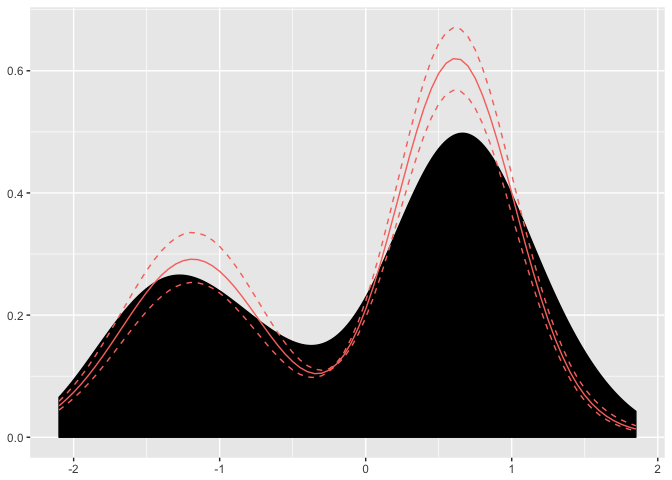
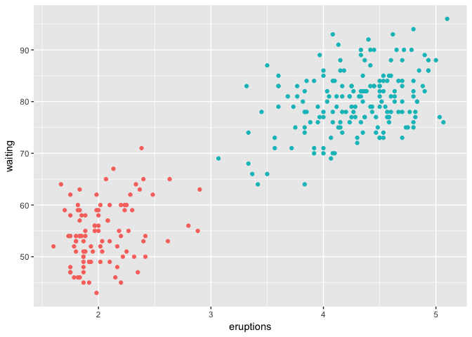

<!-- README.md is generated from README.Rmd. Please edit that file -->
    ## Loading required package: dirichletprocess

    ## Loading required package: ggplot2

dirichletprocess
================

The dirichletprocess package provides tools for you to build custom Dirichlet Process mixture models. You can use the prebuilt Normal/Weibull/Beta distribtuions or create your own following the instructions in the vignette.

Installation
------------

You can install dirichletprocess from github with:

``` r
# install.packages("devtools")
devtools::install_github("dm13450/dirichletprocess")
```

For a full guide to the package and its capabilites please consult the vignette:

``` r
browseVignettes(package = "dirichletprocess")
```

Example
-------

### Density Estimation

``` r
faithfulTransformed <- faithful$waiting - mean(faithful$waiting)
faithfulTransformed <- faithfulTransformed/sd(faithful$waiting)
dp <- DirichletProcessGaussian(faithfulTransformed)
dp <- Fit(dp, 1000, progressBar = FALSE)
plot(dp)
```



### Clustering

``` r
faithfulTrans <- as.matrix(apply(faithful, 2, function(x) (x-mean(x))/sd(x)))
dpCluster <-  DirichletProcessMvnormal(faithfulTrans)
dpCluster <- Fit(dpCluster, 1000, progressBar = FALSE)
```

Then to plot, we take the cluster labels contained in the `dp` object and assing them a colour


