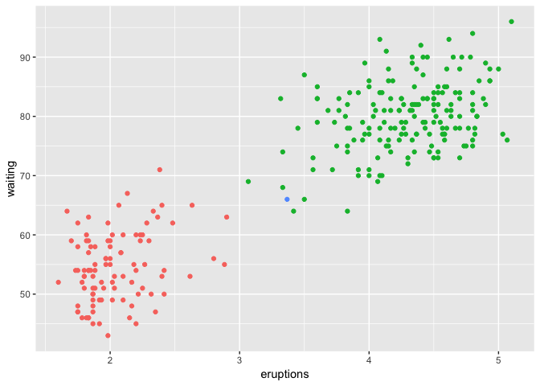

<!-- README.md is generated from README.Rmd. Please edit that file -->
dirichletprocess
================

The dirichletprocess package provides tools for you to build custom Dirichlet process mixture models. You can use the pre-built Normal/Weibull/Beta distributions or create your own following the instructions in the vignette. In as little as four lines of code you can be modelling your data non-parametrically.

Installation
------------

You can install dirichletprocess from github with:

``` r
# install.packages("devtools")
devtools::install_github("dm13450/dirichletprocess")
```

For a full guide to the package and its capabilities please consult the vignette:

``` r
browseVignettes(package = "dirichletprocess")
```

Examples
--------

### Density Estimation

Dirichlet processes can be used for non-parametric density estimation.

``` r
faithfulTransformed <- faithful$waiting - mean(faithful$waiting)
faithfulTransformed <- faithfulTransformed/sd(faithful$waiting)
dp <- DirichletProcessGaussian(faithfulTransformed)
dp <- Fit(dp, 100, progressBar = FALSE)
plot(dp)
```


``` r
data.frame(Weight=dp$weights, Mean=c(dp$clusterParameters[[1]]), SD=c(dp$clusterParameters[[1]]))
#>        Weight       Mean         SD
#> 1 0.371323529 -1.1756510 -1.1756510
#> 2 0.625000000  0.6597522  0.6597522
#> 3 0.003676471  0.1061095  0.1061095
```

### Clustering

Dirichlet processes can also be used to cluster data based on their common distribution parameters.

``` r
faithfulTrans <- as.matrix(apply(faithful, 2, function(x) (x-mean(x))/sd(x)))
dpCluster <-  DirichletProcessMvnormal(faithfulTrans)
dpCluster <- Fit(dpCluster, 1000, progressBar = FALSE)
```

To plot the results we take the cluster labels contained in the `dp` object and assign them a colour



For more detailed explanations and examples see the vignette.
